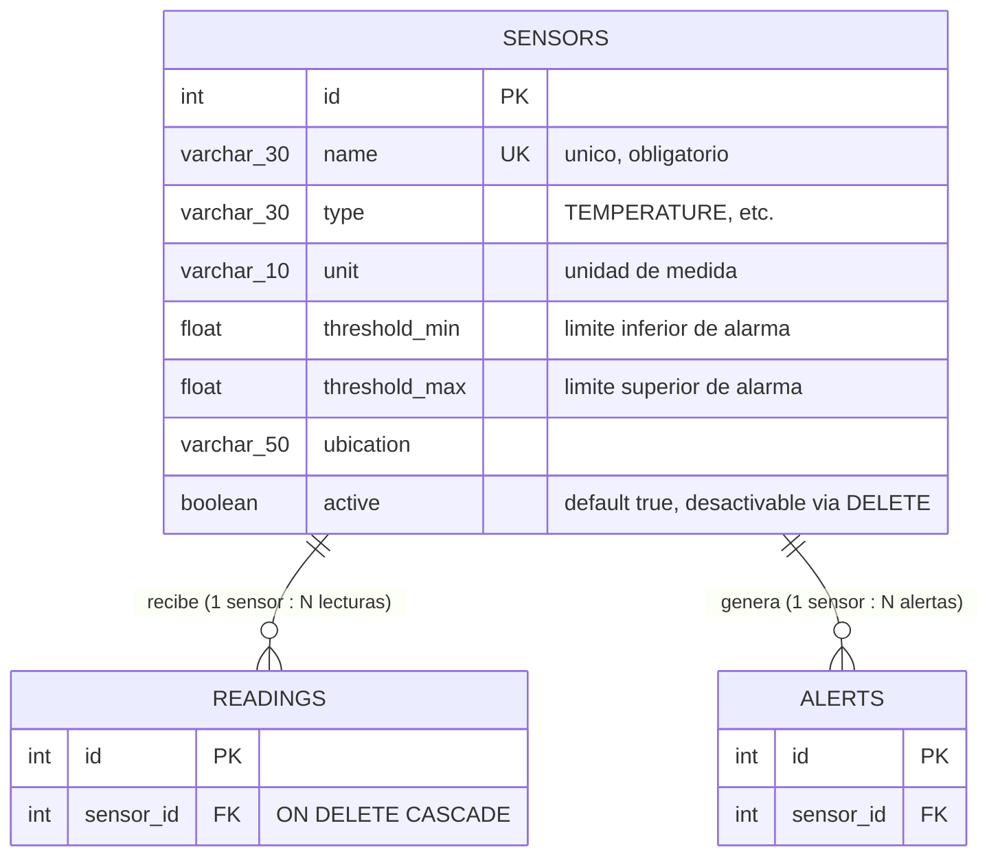
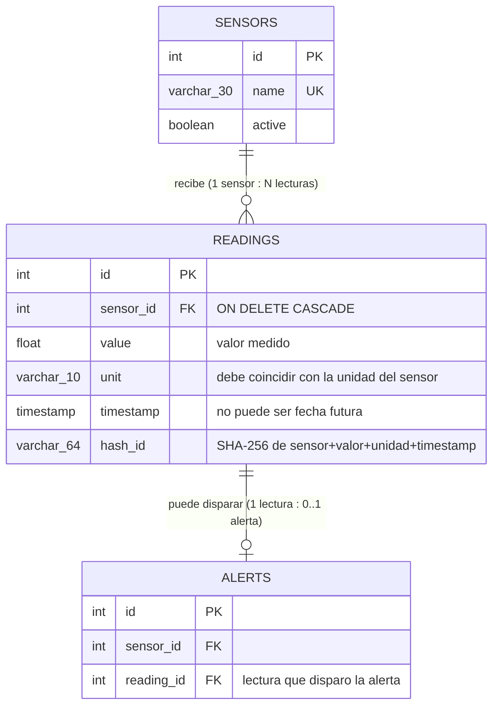
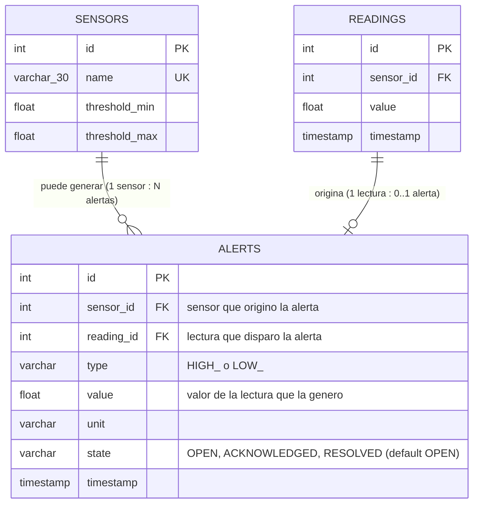
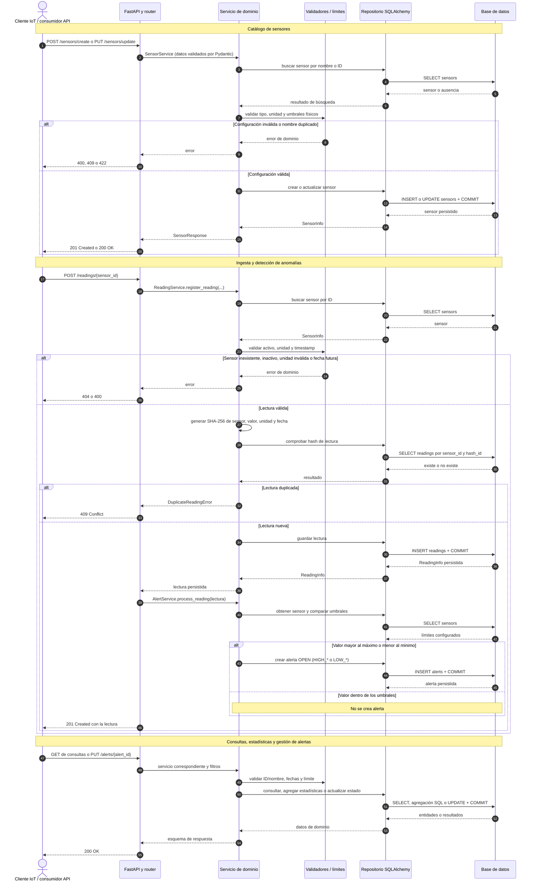

# Registro de Uso de IA (AI Log)

Este documento registra las interacciones con Inteligencia Artificial generativa utilizadas como asistencia para el desarrollo de las actividades durante el curso.

**Nota:** En casi todas las entradas (generación de codigo) la IA comete errores menores que no explico, por ejemplo poner Dict en vez de dict.

---

## Semana 6

## Entrada 6

### Objetivo

Solucionar el problema de `500 internal server error` que corria en Render pero no en los contenedores.

### Prompt

> Al darle una segunda vuelta a la API encontre un error interno del servidor pero en el Render, lo raro es que es el mismo repositorio exactamente que si corre en los contenedores, tengo este log en render:
>
> [Aqui pegue el log de render]

### Resultados

Me mencionó que eran las migraciones, lo cual era cierto. Me ayudó a corregir el `env.py` de las migraciones y a crear un archivo para mantener el repositorio estable en cada despliegue. `start.sh` es el archivo, el cual nos apoya a hacer lo mismo que haría Compose en Docker, pero para Render; es decir, revisa y ejecuta la última migración antes del despliegue

En el proceso de esta entrada tuve otro error breve en el Dockerfile, lo cual me llevó a que revisara qué pasaba, pero no lo cuento como entrada porque fue extremadamente breve; solo se le habia olvidado decirme que tambien tenia que hacer este check en el docker file.

## Entrada 5

### Objetivo

Investigando y leyendo un poco más de información de la página oficial de Mermaid, encontré un modelo de esquema que llamó mucho mi atención por lo simple que es, pero no por eso menos valioso. Me parece que es muy útil para conceptualizar los datos, tiene una primera vista más clara; a mi parecer, es más fácil mapear esquemas de datos o entidades. Sin embargo, no lo seleccioné como principal, ya que siento que no era el óptimo para demostrar el flujo completo y los flujos específicos, que a mi parecer era lo que se solicitaba como diagrama de Mermaid. De todas formas, le pedí que convirtiera los diagramas secuenciales en diagramas estilo entidad-relación.

### Prompt

> Convierte esta misma logica de los 3 mermaid secuenciales en 3 diagramas mermaid pero estilo entidad-relacion, seleccionare cual me gusta mas si secuencia o entidad relacion.

### Resultados

Aquí dejo los Mermaid que entrego; terminé por seleccionar los diagramas secuenciales por su alto nivel explicativo, pero eran buena idea también.

#### Sensores



#### Lecturas



#### Alertas



## Entrada 4

### Objetivo

Corregir el diagrama de Mermaid.

### Prompt

> Encontre 2 errores y 1 correccion que quiero que hagas:
>
> Generaste un solo diagrama monolitico, el cual tiene algunas falla enormes en la sección de anomalias (alertas):
>
> - Las validaciones de ID/nombre no aplica a 2 de los 5 endpoints.
> - Las validaciones de fechas no aplica a 2 de los 5 endpoints.
> - PUT tiene su propia forma de validacion de estado que no se parece en nada a "agregar estadísticas". Esta es la más critica, puesto que meterlos en un solo alt generico no es un error menor, borra justo el tipo de detalles que demuestran que no solo copie y pegue de la IA, si no que pense la arquitectura con cuidado.
>
> Tambien me tome un tiempo para leerlo a pesar de haber hecho un diagrama en mi pizarron, dividelo en diferentes codigos Mermaid, uno por feat (sensors, readings, alerts), quizas sea mas legible.

### Resultados

Implemento tal y como necesitaba los diagramas; tanto la lógica es correcta como los 3 bloques separados. El resultado está visible en el README.

## Entrada 3

### Objetivo

Generar el diagrama de Mermaid en base a mi app/.

### Prompt

> CONTEXTO: Realiza un analisis de la carpeta app/ para comprender la arquitectura backend de SensorHub (patrones de diseño, capas de servicio, modelos de datos y flujos de datos principales).
>
> TAREA: Con base en el analisis previo y en el contexto acumulado, diseña un diagrama de secuencia en Mermaid (de tipo sequenceDiagram) que documente de manera clara el ciclo de vida completo de las peticiones HTTP y la interaccion entre puntos al consumir la API (como cliente o usuario.
>
> RESTRICCIONES:
>
> - Solo puedes crearlo como un sequenceDiagram
>
> ENTREGA: Actualiza el archivo README.md incluyendo al final una nueva seccion estructurada que contenga el bloque de código Mermaid generado.

### Resultados

Genero un solo diagrama monolítico, al cual le encontré una falla enorme en la sección de anomalías (alertas):

- Validar ID/nombre no aplica a 2 de los 5 endpoints.
- Validar fechas no aplica a 2 de los 5 endpoints.
- PUT tiene su propia forma de validación de estado que no se parece en nada a "agregar estadísticas". Esta es la más crítica, puesto que meterlos en un solo alt genérico no es un error menor; borra justo el tipo de detalle que quiero demostrar, que no solo copié y pegué de la IA, sino que pensé la arquitectura con cuidado.

Este era el diagrama:



## Entrada 2

### Objetivo

Valorar mi idea de que hay que hacer para la ultima funcionalidad de SensorHub.

### Prompt

> Para finalizar con SensorHub me queda una tarea, un nuevo endpoint, probablemente en la seccion de sensores, seria un get, esta es lo que me piden:
> RF-6: "Estadísticas por sensor y periodo: mínimo, máximo, promedio"
> Por como lo veo tengo que mostrar un body como esto:
>
> ```python
> sensor_id: int
> sensor_name: str
> total_readings: int
> min_value: float | None
> max_value: float | None
> avg_value: float | None
> ```
>
> Por como tengo la idea, seria agregar un nuevo esquema llamado statisticsresponse en el archivo de esquemas de sensores. Podemos procesar las el min, max y avg en el repositorio de las lecturas y mandarlo directamente a un router (pasando por un servicio propio) dentro de los routers de sensores no? Tienes una mejor idea?

### Resultados

Me comentó que tenía una idea acertada de qué tenía que hacer, pero que, como es una funcionalidad que tiene que ver con el catálogo de sensores, mejor metiera la lógica como una nueva función dentro de catalog.py en vez de crear algo nuevo.

## Entrada 1

### Objetivo

Identificar cuales son las metricas basicas de health en una API REST.

### Prompt

> Como parte de las funcionalidades restantes que debo agregar a mi API REST, tengo que poner mi router health con metricas basicas. Que son estas mketricas basicas? Debo crear todo el ecosistema (esquemas, servicios) para estas metricas?

### Resultados

Menciono que en una API REST como SensorHub existen varios esquemas de trabajo para el endpoint de health; el que tengo ahora mismo es un esquema del tipo Liveness Probe, es decir, solo prueba si Python corre y si la API recibe peticiones. Para un health básico de producción, se debe usar Readiness Probe; aquí health funciona para decirnos el estado de las dependencias clave (bases de datos) con consultas triviales como SELECT 1, la latencia de las peticiones en ms, cuánto tiempo lleva la aplicación corriendo, timestamp, versionado; algunos esquemas también consideran CPU y RAM.

---

## Semana 5

## Entrada 18

### Objetivo

Encontrar errores usando la checklist de peer review con IA.

### Prompt

> Tengo una checklist que aprobo mi par para la revision por pares, sin embargo me gustaria pulir mas esa peer con errores objetivos o que no cumplen con la siguiente checklist que el no vio:
>
> - El PR se entiende y se puede probar sin preguntar.
> - La estructura oficial del repositorio se respeta.
> - Cada capa hace solo lo suyo.
> - verbos, las rutas y los códigos de estado son los de la tabla.
> - Hay paginación y filtros, y funcionan de verdad.
> - Pydantic valida entrada y salida, con física real.
> - Los errores usan HTTPException y el código correcto.
> - La persistencia usa SQLAlchemy 2.x y el patrón repositorio.
> - El DIP se sostiene y la sesión se cierra.
> - pruebas de integración prueban, y el repositorio está limpio.
>
> Tienes acceso a app/ y a test, a todas las carpetas y archivos interiores, solo verifica, no hagas NINGUN CAMBIO, dame un resumen de que esta bien, que esta mal y que es mejorable pero cumple.

### Resultados

En general, menciona que mi repositorio y mi API cumplen con la mayoría de puntos y que, con los que no, son cambios menores que no rompen con la funcionalidad ni la integridad de mi API, con excepción de uno; cito a la IA:

```text
Está bien

- La estructura coincide con la documentada: routers, services, repositories, models, schemas, migraciones y tests.
- Hay separación funcional razonable: los servicios dependen de Protocol de repositorios, y los repositorios usan
SQLAlchemy 2.x (Mapped, mapped_column, select, scalars).
- La sesión se cierra correctamente mediante yield y finally
- Existen esquemas Pydantic de entrada y salida, con response_model y from_attributes.
- Lecturas y alertas implementan filtros de fecha, orden determinista y limit/offset en la consulta SQL.
- Los errores de dominio previstos se traducen consistentemente a HTTPException; hay 404, 409, 400 y los 422 nativos
de Pydantic.
- Las pruebas son integración HTTP reales contra FastAPI y una SQLite en memoria, no meros mocks.

Esta mal

- Las migraciones no levantan una base nueva. La migración inicial crea sensors y readings, pero ninguna crea alerts;
una migración posterior intenta agregarle state, por lo que alembic upgrade head fallaría desde cero. 
Base.metadata.create_all() en arranque puede ocultar este error, pero no reemplaza las migraciones.

Mejorable pero cumple

- El DIP se cumple dentro de servicios mediante Protocol, pero los routers construyen repositorios concretos directamente.
Mover ese ensamblado a dependencias facilitaría sustituir infraestructura y testear.
- Los filtros y la paginación existen y están aplicados en SQL, pero las pruebas no demuestran una página posterior
(offset), el filtrado exitoso por fechas, ni el orden de resultados. Solo prueban límites o rangos inválidos.
- Los sensores admiten paginación, pero limit y offset no usan restricciones FastAPI (ge=1, ge=0) como sí lecturas y
alertas; valores negativos o cero no quedan uniformemente validados.
- Pydantic está presente, pero los schemas permiten campos extra por defecto y varias reglas de dominio quedan fuera del
esquema. Es válido, aunque menos estricto para una API.
- Cada persistencia hace commit propio. Al crear una lectura y su alerta, si falla la alerta la lectura ya quedó confirmada:
convendría una transacción única.
```

Como urgente, revisaré 2 cuestiones, una que encontró mi peer, acerca de cómo uso PUT y PATCH en mi repositorio y las migraciones con Alembic, por cómo lo he probado en dockers, funciona correctamente. Sin embargo, tengo que darle una revisada, ya que solo ejecuto los comandos de Alembic para migraciones, pero no reviso a detalle qué sucede.

## Entrada 17

La entrada 17 de la semana 5 es parte del ejercicio de AI review. Se puede encontrar en el archivo [AI_CODE_REVIEW.md](semana5/AI_CODE_REVIEW.md) como "Tarea 3".

## Entrada 16

### Objetivo

Había una función llamada `search_sensor` que vivía en `catalog.py`. Esta función sirve para buscar un sensor por ID, nombre o ambos y verificar congruencia entre ambos; en un principio era solo para la lógica de los sensores, pero creció a todas las lógicas. Esto significaba que ahora debía pasarse a `validators.py` y ya no vivir más en `catalog.py`. La entrada fue para que reconfigurara todo solo.

### Prompt

> Dentro de `app/services/catalog.py` existe una funcion llamada `search_sensor`, es una funcion que permite que en endpoints donde necesito buscar un sensor se pueda hacer por id, nombre o ambos y valida si id y nombre tienen sentido con el sensor registrado. Esa funcion en un inicio era para la logica de los sensores, pero se extendio y ahora se usa en `app/services/(anomalies e ingestion)`. En este momento esta siendo heredada desde catalog lo que en mi estructura y arquitectura esta mal, hay un archivo llamado validators que sirve especificamente para funciones de error o de validacion que se usan en todas services. Necesito que muevas `search_sensor` de catalog a validators y cambies las herencias y de los demas archivos de services para que ahora apunten a esa funcion pero en validators.
>
> NO QUIERO QUE CAMBIES NADA DE LA LOGICA DE NINGUN ARCHIVO, solo es mover y ajustar donde esta ahora esta funcion.
>
> Por esto mismo solo te permito leer y escribir en app/services, no fuera.

### Resultados

Hizo literalmente lo que pedi, pense que generaria una clase nueva pero no, literal copio y pego. Esta bien es lo que queria pero arregle para hacerlo una clase (cumple SRP).

## Entradas de refactorizacion

> **Finalice**

### Objetivo

Realicé un esquema en Lucid para poder visualizar todo lo que debía hacer la API y las mejoras de usuario con respecto a errores que quería hacer. Esto con el fin de hacer una refactorización de cómo funcionan los errores dentro de la API, extendiendo muchísimo los casos que reviso y mejorando la experiencia del usuario. El diagrama se puede encontrar en: [Diagrama de Lucid](docs/images/ConceptMap.png). Esto fue y es un cambio enorme, no a nivel de estructura, sino a nivel de cuántas líneas de código debo tomar en cuenta y cambiar por nuevos nombres o más verificaciones. Necesitaba ayuda de la IA (no salió nada bien).

### Prompt 1

Este prompt salió TERRIBLE; a pesar de ser el más extenso y específico que escribí, por alguna razón la IA reconfiguró por completo la API. Funcionaba, pero no quedaba prácticamente rastro de mi código. Descarté por completo.

> CONTEXTO: He actualizado la arquitectura y el manejo de excepciones para la API (modulos de Sensores, Lecturas y Alertas). Como ya sabes. actualmente el proyecto cuenta con una base de codigo (`app/`) y una suite de pruebas (`test/`) que necesitan ser refactorizadas para adaptarse a esta nueva extension. Es una refactorizacion no crear todo desde 0.
>
> TAREA: Refactoriza y consolida la logica de la API y su suite de pruebas para que coincida exactamente con lo siguiente:
>
>Sensores: Es un CRUD
>
> - En POST solo se puede registrar si el registro tiene TODOS los campos llenos. Los errores relacionados son:
>   - SensorNameDuplicateError 
>   - SensorNameTooLongError 
>   - InvalidSensorTypeError 
>   - InvalidSensorUnitError 
>   - LowThreshGreaterThanHighThreshError 
>   - SensorThresholdOutOfRangeError 
>   - MissingRequiredFieldsError
> - En GET hay 2 endpoint, listar todos los sensores por paginacion o buscar un sensor por id o por nombre o ambos. Los errores relacionados son: 
>   - Para listar todos los sensores ningun error 
>   - Para buscar por nombre o id:
>     - SensorNotFoundError 
>     - SensorNameOrIDDontMatchError
>     - MissingRequiredFieldsError 
> - En PUT solo se puede actualizar un sensor por id o nombre o ambos. Los errores relacionados son los mismos que en GET + POST + NeddedChangesToUpdateSensorError 
> - En DELETE solo se puede eliminar por id o nombre del sensor o ambos y son los mismos errores que en GET + SensorAlreadyInactiveError
>
> Lecturas: Es un Append-Only
>
> - En POST solo se puede registrar si el registro tiene valor y unidades llenos, los campos son: valor, unidad y timestamp (es opcional pero si no lo pone el usuario se genera automaticamente). Los errores relacionados son:
>   - MissingRequiredFieldsError
>   - SensorNotFoundError
>   - SensorInactiveError
>   - InvalidReadingValueError
>   - ReadingValueTooLongError
>   - DuplicateReadingError
>   - SensorCantProcessUnit
>   - InvalidTimestampError
>   - FutureTimestampError
> - En GET solo se puede listar lecturas por nombre o id del sensor o ambos por paginacion y filtro de fechas, los errores relacionados son: 
>   - SensorNotFounError 
>   - SensorNameOrIDDontMatch
>   - MissingRequiredFieldsError
>
> Alertas: Es un REST de GET y PUT unicamente
> 
> - En GET se pueden buscar alertas por sensor, por nombre o id o ambos con paginacion y filtro de fechas, se pueden listar todas las alertas por paginacion y filtro de fechas, y se pueden buscar alertas por su propio id (alert_id). Los errores relacionados son: 
>   - Para listar todas las alertas: Ningun error 
>   - Para buscar por id de alerta:
>     - AlertNotFound 
>   - Para buscar por nombre o id de un sensor: 
>     - SensorNotFound 
>     - SensorNameOrIDDontMatchError
>     - MissingRequiredFieldsError
>
> - En PUT se pueden actualizar estados de la alerta (por defecto/ acknowledged / resolved). Los errores relacionados son:
>   - SensorNotFound
>   - InvalidAlertStatusError
>   - NeddedChangesToUpdateSensorError
>   - MissingAlertStatusError
> Para ejecutarlo debes usar 3 fases:
> - Pruebas TDD: Reintegra y actualiza `test_api.py`, borra todos los test que hay ahora mismo (NO LO QUE HAYA ANTES) y escribe una prueba que valide el flujo correcto y otro que fuerce el error
> - Integracion: Actualiza la logica del codigo de `app/` para hacer pasar todas las pruebas nuevas
> - Verificacion: Corre pytest en el entorno virtual para verficiar que todo funciona
>
> RESTRICCION:
> - Elimina todos los errores y excepciones anteriores (`app/services/validators.py`) que ya no formen parte del nuevo diagrama. Solo deben existir las excepciones definidas en el nuevo modelo.
> - Priorizar la reutilizacion del codigo existente (modelos, schemas, servicios, capas). No reescribir desde cero lo que ya funciona.
> - NO agregues nuevas librerias ni herramientas avanzadas que no estén presentes en el codigo actual (por ejemplo, NO usar unittest.mock, pytest-mock, etc). Esto para que entienda todo le codigo que generes
> - No generes nuevos archivos, solo modifica y lee lo que hay dentro de `app/` `test/`
> - Respeta cada subcarpeta de `app/`, es decir cada resposabilidad que tiene cada carpeta
>
> ENTREGA: Breve resumen de lo que cambiaste. Codigo pasando todas las pruebas del TDD y el cover > 90%

### Prompt 2

Aquí reduje la cantidad de cosas que tenía que hacer; así era menos lo que tenía que revisar a mano y era más fácil de corregir. Error: a pesar de ser bastante específico, el prompt no hizo lo que quería y, de hecho, rompió la base de datos; no funcionaba el Swagger y hubo error en Alembic. Aquí me di cuenta de que hasta ahora estaba trabajando por pedazos de pedazos, es decir, trabajaba def, class, un archivo a lo mucho; ahora estaba intentando trabajar una arquitectura completa. Entonces, a partir de aquí tome la decisión de leer los resúmenes de cambios que hacía la IA y tomar las partes que más me agradaran o entendiera perfectamente e incluirlas; era como armar un lego.

> CONTEXTO:
> Vamos a refactorizar los modulos de SENSORES por partes para alinearlo con el nuevo diagrama de arquitectura y manejo de errores. Tengo un proyecto funcional existente y NO quiero reescribirlo desde cero ni cambiar la arquitectura. Debes imitar exactamente mi estilo de codigo, mi sintaxis, mi convencion de nombres y el diseño de mis modulos.
>
> TAREA:  Refactorizar UNICAMENTE el modulo de Sensores aplicando TDD (Test-Driven Development) estricto. La refactorización debe cubrir únicamente los siguientes endpoints y sus errores:
>
> 1. POST /sensores: 1 endpoint
> Requiere todos los campos: nombre, tipo, unidad, umbral_min, umbral_max, ubicacion. (el id y active se generan automaticamente tal cual esta)
>
> - Errores a probar e implementar:
> - SensorNameDuplicateError
> - SensorNameTooLongError
> - InvalidSensorTypeError
> - InvalidSensorUnitError
> - LowThreshGreaterThanHighThreshError
> - SensorThresholdOutOfRangeError
> - MissingRequiredFieldsError (Si no hay nada en nombre o id)
>
> 2. GET /sensores: 2 endpoints
> Para listar todos (admite paginacion e include_inactive = true/false): Ningun error.
> Para buscar por nombre o id o ambos (obligatorio uno minimo):
>
> - SensorNotFoundError
> - SensorNameOrIDDontMatchError
> - MissingRequiredFieldsError (Si no hay nada en nombre o id)
>
> 3. PUT /sensores: 1 endpoint
> Actualizar por id o nombre o ambos (obligatorio uno minimo).
> Errores a probar e implementar:
>
> - SensorNotFoundError,
> - SensorNameOrIDDontMatchError,
> - SensorNameDuplicateError,
> - SensorNameTooLongError,
> - InvalidSensorTypeError,
> - InvalidSensorUnitError,
> - LowThreshGreaterThanHighThreshError,
> - SensorThresholdOutOfRangeError,
> - NeddedChangesToUpdateSensorError,
> - MissingRequiredFieldsError (Si no hay nada en nombre o id)
>
> 4. DELETE /sensores: 1 endpoint
> Pasa de activo a inactivo (soft delete) por id o nombre. o ambos (obligatorio uno minimo).
> Errores a probar e implementar:
>
> - SensorNotFoundError
> - SensorNameOrIDDontMatchError
> - SensorAlreadyInactiveError
> - MissingRequiredFieldsError (Si no hay nada en nombre o id)
>
> RESTRICCIONES TECNICAS:
>
> - METODOLOGÍA TDD EXCLUSIVA: Primero escribe en un nuevo archivo dentro de `test/`
>   - a) Test del caso de exito, por ejemplo uno donde al buscar un sensor en GET se haga correctamente.
>   - b) Test individual por cada error mencionado arriba, por ejemplo uno donde GET no tenga id, nombre o ambos y se tire el error.
> - NO reescribir ni eliminar la estructura existente: Modifica o añade UNICAMENTE las funciones y líneas de codigo necesarias para integrar esta logica. Preserva la lógica base actual.
> - NO agregar librerias ni imports externos que no esten ya en el proyecto (prohibido agregar unittest.mock, pytest-mock o frameworks nuevos). Manten los mismos imports de la app.
> - Elimina cualquier excepcion (dentro de `app/services/validators.py`) antigua del módulo de sensores que ya no esté en la lista anterior.
> - Manten exactamente mi sintaxis y formato, por ejemplo usar para routers la misma idea de raise ...
>
> ENTREGA:
>
> 1. Codigo de Pruebas (Tests de Sensores) con casos de exito y casos de error.
> 2. Codigo de Implementacion del Módulo de Sensores (Schemas, Excepciones, Servicios/Endpoints, etc.) modificado de forma quirurgica.

### Prompt 3

Aquí ya había terminado la refactorización de SENSORS. Empecé con READINGS y cambié de tipo de prompting a lo más habitual, a lo que estoy acostumbrada. Agregándole al final una metodología que vi en TikTok para que planificara antes de empezar.

> Estoy haciendo una refactorizacion bastante agresiva de mi API, en este momento la seccion de registro deberia correr perfectamente, pasa todos los 28 test que le puse como deberia de ser. Ahora mismo estoy completamente trabada en la siguiente seccion que es lecturas, ya genere los test para hacer Test Driven Development pero no importa como inicie siempre sale mal. Lo raro aqui es que la mayoria del codigo ya esta hecho, ya deberia de funcionar por que esto es una refactorizacion no es una generacion de codigo desde 0, solo agrego diferentes situaciones de error que antes no estaban y renombro algunas otras.
>
> Necesito que me ayudes a concretar los 14 test que tengo, generando el codigo tal cual como lo necesito. Arma una planificacion, corregimos y empezamos.

### Prompt 4

Empezamos alertas. Y me hizo un breve cuestionario de qué debía hacer alertas.

> Bien aqui es donde entra el ultimo modulo, la gestion de alertas, la que tengo es muy basica, como es algo bastante nuevo, lo haremos por TDD, primero generaras los test tal cual yo lo hago y luego programaras mediante eso, tengo seccionado ya la parte final de test_api.py, revisalo

### Prompt 5

Este es el prompt final de este refactor.

> Que debe hacer alerts? Alerts es un endpoint donde puedes leer alertas por medio de el id o nombre o ambos de un sensor, leer alertas por id de la propia alerta y leer todas las alertas, estos endpoint tienen paginacion y filtros de fechas.
> Luego puedes actualizar SOLO UN PARAMETRO, que es state, solo lo puedes modificar entre open, acknowledged y resolved y es por medio de unicamente el ID de la alerta, entonces es por PUT.
> Los errores relacionados son:
> Para lectura por sensor id, nombre o ambos: SensorNotFoundError, SensorNameOrIDDontMatchError, InvalidDataRangeError y MissingRequiredFieldsError
> Para lectura por id de la alerta: AlertNotFound(Nuevo!!), InvalidDataRangeError y es en path, no tiene Missin
> Para leer todas las lecturas: InvalidDataRangeError
> Para actualizar estados por id de las alertas: AlertNotFound, InvalidAlertStatus (nuevo! Para cuando el usuario ponga algo que no son los 3 estados), NeededChangesToUpdateError (lo mismo que en el put de sensores, se necesitan cambios para haber actualizacion), MissingAlertStatusError (nuevo! Por si el usuario deja en blanco el state)
> OBVIAMENTE las alertas son en contra de los umbrales seleccionados al crear el sensor, por ejemplo si al crear el sensor metemos umbral de -20 a 30 y mi lectura asociada a ese sensor mide -30 se tira alerta para ese sensor. Espero me comprendas.

### Resultados

Fue toda una odisea; tardé aproximadamente unas 6 horas en esto. Entre frustraciones, breaks y todo, aprendí algo muy importante: la IA no es superpoderosa, y parece una tontería, pero creo que es el motivo de la semana. La IA comete más errores incluso que yo, más que todo en el área de lógica; no se para a pensar realmente si algo está bien o mal, solo lo implementa y arregla hasta que funciona. Es importante dar buenas instrucciones a la IA, es importante el prompting, pero con esto considero que es más importante saber llevar una metodología de trabajo: primero esto, luego esto, luego esto, e incluso poder comunicar ideas con tus propias palabras sin necesidad de tanto "papeleo". También puede ser que yo lo haya hecho mal, pero creo que aprendí bastante.

## Entrada 10

### Objetivo

En base a un esqueleto funcional en 5 archivos, generar las importaciones y lógica de negocio faltante para cumplir US-02: Detección de anomalías.

### Prompt

> CONTEXTO: Deje una estructura organizada en 5 archivos nuevos:
> `app/models/alerts.py` `app/schemas/alerts.py` `app/repositories/alerts.py` `app/routers/alerts.py` y `app/services/anomalies.py` con un esqueleto "funcional" (cumple con 1 test).
> Aqui vamos a cumplir con US-02: Detección de anomalías. Hasta ahora teniamos un sistema que tiene un umbral, tiene restricciones para ese umbral pero no hace nada. En si, debemos hacer un sistema que identifique anomalias en las lecturas de un sensor en base a su umbral y se puedan consultar en un endpoint
>
> TAREA: Generar el codigo necesario para cumplir con los 3 test de US-02 + dejar listo el panorama para hacer un update rapido para US-03
>
> RESTRICCIONES:
>
> - El endpoint solo debe permitir lectura, un GET. No PUT, no POST, etc.
> - Por cada clase y def que exista debes poner un comentario entre triples comillas de no mas de una linea explicando brevemente que hace esa clase o funcion
> - Debes dejar la estructura lista para expansion inmediata, el siguiente US se trata de gestionar alertas basico, identificar por ID, listar con > paginacion y busqueda por filtro de fecha
> - Lo mismo de siempre, no uses imports/librerias que no hayamos usado en el proyecto
> - Puedes leer los archivos nuevos + `test/test_api.py` + `app/main` + toda la carpeta de services y modificar solo los archivos nuevos (alerts y anomalies) + carpeta services
>
> ENTREGA: El codigo minimo funcional para cumplir los test. Debes correr al final en el entorno virtual pytest y deben salir error en 3 test unicamente y mypy y ruff sin errores en app/

### Resultados

Modificó todos los archivos que le solicité + un archivo en routers (+55 -50), que no le había dado permiso explícito, pero se lo concedi después. Esta nueva estructura me parece mucho más consistente en resultados que las que uso comúnmente; al menos en código la usaré siempre o en la mayoría de ocasiones.
Por el lado de los resultados, entrego un mypy limpio, un ruff limpio y el pytest pasa con solo 3 errores, que son los 3 de US-03. Cumplió con los comentarios y, de hecho, los hizo como los hago yo, es decir, sin acentos (recordar que tengo el teclado en inglés). Todo el código que entrego lo entiendo, evito las librerías externas que no conozco y dejo apertura simple para el update; lo haré sin IA.

## Entrada 8 y 9

Las entradas 8 y 9 de la semana 5 son parte del ejercicio de comparacion entre prompts basicos vs estructurados. Se puede encontrar en el archivo [PROMPTING.md](semana5/PROMPTING.md) como "Tarea 3".

## Entrada 6 y 7

Las entradas 6 y 7 de la semana 5 son parte del ejercicio de comparacion entre prompts basicos vs estructurados. Se puede encontrar en el archivo [PROMPTING.md](semana5/PROMPTING.md) como "Tarea 2".

## Entrada 3, 4 y 5

### Objetivo

Arreglar la instalación de Aider.

### Prompt 1

> Acabo de instalar Aider para hacer automatizar revisiones y commits en git, lo hice desde mi Ollama usando Qwen 2.5-coder: 7B-base. Mi Ollama esta corriendo en windows no lo tengo en el WSL2 pero tampoco veo necesario instalarlo doble, pero Aider encuentra un problema y no logra conectar bien con Ollama. Me tira este error:
>
> ```bash
>  You can skip this check with --no-gitignore
>
> Add .aider* to .gitignore (recommended)? (Y)es/(N)o [Yes]: y
>
> Added .aider* to .gitignore
>
> OllamaError: Error getting model info for qwen2.5-coder:7b. Set Ollama API Base via `OLLAMA_API_BASE` environment variable. Error: [Errno 111] Connection refused
>
> Warning for ollama/qwen2.5-coder:7b: Unknown context window size and costs, using sane defaults.
> ```
>
> Como puedo solucionarlo?

### Prompt 2

> Bien, funciona, ya no me tira el error, pero me di cuenta de otro error, si lo intento ejecutar en el entorno virtual no me lo permite, me tira directamente aider command not found, sin embargo por como vi la instalacion de Aider se instalo con uv y si ejecuto pip list en el entorno virtual y el global no aparece Aider, es decir se instalo en una carpeta externa pero aun asi funciona, como soluciono eso?

### Prompt 3

> Ya funciona automaticamente, esta todo perfecto. Para finalizar con Aider (creo) tengo que hacer un archivo `conversions.py`, supongo que este debe ser automatico, se configura de alguna manera o le digo a Aider en cada prompt que agregue el contexto, el prompt que hizo y el commit final en dicho archivo?

### Resultados

Para la primera solución, me mencionó que esto ocurre porque estamos en entornos aislados; tanto Windows como WSL2 de forma nativa no se pueden hablar; había que hacer unas configuraciones para que pudieran comunicarse sin errores. La solución fue agregar Ollama como variables de entorno de Windows para mi usuario y ejecutar Ollama en el mismo puerto que Aider.

```bash
set OLLAMA_HOST=0.0.0.0
set OLLAMA_ORIGINS=*
ollama serve
```

```bash
curl http://$(ip route show | grep default | awk '{print $3}'):11434/api/tags
run-aider
```

Para la segunda solución, fue un poco más simple; teníamos que agregar Aider a una ruta PATH para que el .venv pudiera hablar con Aider, que estaba instalado en una carpeta de Debian externa al proyecto. El comando se ve así: `export PATH="$HOME/.local/bin:$PATH"`

Para la última solución, me mencionó que si necesitaba el archivo conversation.py, se lo podía pedir manualmente, ya que, y como había pensado, Aider genera su propio archivo llamado .aider.chat.history donde guarda todo el chat; entonces era innecesario. A todo esto, revisé el checklist para la entrega semanal y no se menciona este archivo como un requisito, entonces pasaré de él.

## Entrada 1 y 2

Las entradas 1 y 2 de la semana 5 son parte del ejercicio de comparacion entre prompts basicos vs estructurados. Se puede encontrar en el archivo [PROMPTING.md](semana5/PROMPTING.md) como "Tarea 1".

---

## Semana 4

## Entrada 3

### Objetivo

Cuando tiré `docker compose up⁣`, encendía la base de datos, pero no la API, y me tiraba error `SQLite objects created in a thread can only be used in that same thread`, lo que me llevó a `db.py`, a la línea de `connect_args["check_same_thread"] = False`. Intenté hacer de todo para mantenerla, pero solo sirvió eliminarla, y no sabía por qué. Necesitaba que la IA me explicara.

### Prompt

> Si tengo `connect_args["check_same_thread"] = False` en una database de SQAlchemy 2.x (SQLite), y funciona en un container de dockers pero al usarlo en un compose me da error, a que se debe?

### Resultados

Me explicó que PostgreSQL no soporta SQLite, por lo que no soporta `check_same_thread`. Esto se debe a que SQLite es una base de datos embebida y PostgreSQL es cliente-servidor; al ser así, PostgreSQL tiene su propio sistema de gestión de conexiones y concurrencia, es decir, cuando la app se conecta a PostgreSQL, no está accediendo a un archivo como tal, sino que está hablando con un proceso de servidor que ya sabe cómo llevar muchas conexiones simultáneas, no hay necesidad de que yo se lo indique.

## Entrada 2

### Objetivo

Mejorar y optimizar `.gitignore` y crear `.dockerignore` para mantener seguridad e integridad en el despliegue de la API.

### Prompt

> Revisando informacion de dockers me encontre con un archivo tipo .gitignore llamado .dockerignore, entiendo que es para ignorar los dichos "secretos" que pueden ocacionar problemas en el despliegue y contenerizacion de mi API. Necesito crear el archivo, las plantillas que encuentro en internet tienen muchos documentos ignorados, creo que para este punto es un poco de sobreingenieria, necesito que me crees un .dockerignore en la raiz del proyecto con lo justo y necesario para poder crear imagenes/containers, desplegar docker compose, alembic y render.
>
> Aprovechando el commit, revisa mi .gitignore, en este momento tiene un monton de frameworks que ni conozco ni uso como Django, Flask, Scrappy, Marimo, entre otros. Elimina los ignore que no sean de Python, FastAPI, Dockers, Linters, editores de codigo, entornos y base de datos.

### Resultados

Entrego los 2 archivos tal cual se los pedí. El .dockerignore lo comparé con los dockerignore de otros repositorios en GitHub y modifiqué algunas cosas; agregué `*.db-journal`, `*.log`, `*.py[cod]`. Lo mismo para el gitignore; solo tuve que ajustar un poco lo que entrego para dejarlo más seguro.

## Entrada 1

### Objetivo

Evitar buscar el link del Swagger y desplegarlo automáticamente.

### Prompt

> Hay manera de que cuando inicie la API me tire el mensaje con el link correcto (http://localhost:8000/docs) para abrir el Swagger, es medio cansado estarlo buscando cada que quiero probar manualmente algo.

### Resultados

Me tiró aproximadamente 4 líneas de código, donde importaba de fastapi.responses, RedirectResponse y configuraba la ruta. Me explicó las líneas, qué hacen y cómo. Como "detalle pro", incluyó `include_in_schema=False`. Tuvo un error de mypy no-untyped-def y lo solucioné.

---

## Semana 3

## Entrada 6

### Objetivo

Tener una plantilla para escribir ADRs.

### Prompt

> Necesito escribir un ADR acerca de mi API, se que es un documentos donde relato decisiones importantes de arquitectura, pero no se como se estructura. Entregame una plantilla y realizame un cuestionario que al contestarlo y mandarselo junto a la plantilla a cualquier IA me genere automaticamente el ADR

### Resultados

Me generó la siguiente plantilla en Markdown (ideal para hablar con IAs y para el repositorio):

```markdown
# ADR-00X: [Título de la decisión]

- **Estado:** Aceptado
- **Fecha:** 2026-07-30
- **Autores:** [Tu Nombre / Equipo]

## Contexto
[¿Qué problema o necesidad técnica/negocio teníamos que resolver?]

## Decisión
[¿Qué solución elegimos y por qué?]

## Opciones Consideradas
1. [Opción A]
2. [Opción B (Elegida)]

## Consecuencias
**Positivas:** [Beneficios ganados]
**Negativas / Desventajas:** [Trade-offs o sacrificios aceptados]
```

Abajo creo el cuestionario, dividiéndolo en 3 secciones:

1. Problema: ¿Qué dolor, cuello de botella o restricción tenías?
2. Solución elegida: ¿Qué implementación o patrón seleccionaste?
3. Opciones descartadas: ¿Qué otras opciones consideraste y por qué no las usaste?
4. Ventajas principales: ¿Qué ganaste?
5. Desventajas / Sacrificios: ¿Qué costo o complejidad asumiste a cambio?

El siguiente prompt que le mandé fue el cuestionario resuelto; no lo agregaré como otra entrada.

## Entrada 5

### Objetivo

Revisar y mejorar estéticamente el Swagger de la API.

### Prompt

> Se puede mejorar de alguna manera la presentacion del Swagger de la API? Es decir la pagina que me sale al hacer "uvicorn app.main:app --reload"

### Resultados

Este prompt fue con Gemini, no Antigravity. Me mostró múltiples formas de mejorar la estética, personalizar los routers con descripción, agregar una descripción a la API, mejorar la forma en la que se muestran ejemplos en schemas, etc. De eso elegí solo ponerles una descripción a los routers y cambiarles el título a mayúsculas.

## Entrada 4

### Objetivo

Validar la nuevo estructura de app/. Se modificaron nombres de algunas clases, funciones, variables, y uso de ciertos archivos.

### Prompt

> Realice multiples cambios en todo el repositorio, los mas grandes se encuentran dentro de services/ justo ahi quiero que revises lo siguiente:
>
> 1. Catalog.py:
> - Contiene `SensorDuplicateError` `SensorNotFounError` y `SensorService` implementa create_sensor, list_sensors, get_sensor, update_Sensor con sentido legibilidad y comentarios acertados
> 2. Ingestion.py:
> - Contiene `DuplicateReadingError` `ReadingService` y get_now, todos son legibles, bien implementados y tiene comentarios acertados
> 3. Validators.py:
> - Contiene `ReadingValidationError` `SensorInactiveError`, `UnsupportedUnitError` y `ValueOutOfRangeError` implementados con comentarios acertados y son de facil mantenimiento
>
> Especificamente lo que me interesa es que el codigo dentro de los 3 archivos este correcto en ese archivo, es decir que no haya cosas que deberian ir en ingestion en validators, que haya entendido bien el funcionamiento de services y la division que genere

### Resultados

Al no detectar cambios dejo directamente una cita de la IA:
```text
La separación de los módulos catalog, ingestion, validators es limpia y no rompe el comportamiento. 
Cada archivo tiene una responsabilidad clara:

    • Catálogo → gestión de sensores.

    • Ingesta → recepción, deduplicación y almacenamiento de lecturas.

    • Validadores → reglas puras de negocio para las lecturas.

Todo el flujo original funciona igual, y la modularidad ahora facilita el mantenimiento y los tests.
```

## Entrada 3

### Objetivo

Terminar los ultimos 3 archivos para feat commit de US-04.

### Prompt

> Generando la estructura para las lecturas y lo solicitado en docs/BACKLOG.md en la seccion de US-04, entre en completo burnout. Tener 8 archivos abiertos para escribir + BACKLOG + archivos de sensors para guiarme, es muy dificil, estoy confundiendome todo el rato de archivos, de nombres de funciones o clases y es poco eficaz esto que estoy haciendo.
>
> En los archivos services/ingestion.py y validators.py asi como routers/readings.py escribe el codigo faltante. En validators debes crear los errores de dominio, por ejemplos hacer la excepcion si el sensor no existe, si el sensor esta inactivo, si no soporta la unidad, valores fuera del rango permitido. En ingestion debes gestionar servicios de lectura de sensores:
>
> 1. Verifica que el sensor existe
> 2, Verifica que el sensor este activo
> 3. Valida la unidad de medida soportada
> 4. Valida el rango fisico, si esta dentro
> 5. Calcula el hash (clase para calcular el hash)
> 6. Verifica duplicados
> 7. Guarda la lectura
>
> Por ultimo en routers debes de agregar las rutas que apareceran en la API, en este caso creo que deberia ser un unico POST pero valida junto con BACKLOG.md

### Resultados

Impecables, salvo los típicos errores de IA, como poner Optional en vez de "| None" o pass en vez de "..." que tuve que arreglar manualmente, ya que no pasan los linters; al ejecutar pytest pasa con +99% de cobertura, sin errores de compilación o de lógica. Todavía no lo probé en el Swagger, solo validé los test; primero haré una refactorización del código completo, poniendo comentarios, mejorando legibilidad y, en general, dejar un código de US-04 completo; sin embargo, en este punto ya funciona.

## Entrada 2

### Objetivo

Probar Antigravity, ya que el anterior prompt era para texto y Gemini lo consideró un excelente modelo para platicar; lo hice en web. Esto, como es dentro de mi VSCode, no sé qué tan amigable sea la web para adjuntar todo un repositorio; entonces descargué y agregué la extensión de Antigravity a VSCode (la cual ya no funciona y tuve que descargar el IDE).

Debía buscar entre el repositorio las direcciones proporcionadas, entender el código, la lógica de negocio de cada archivo y darme una conclusión en base a mi análisis de qué va en cada carpeta y lo que encontró y si era correcto.

### Prompt

> Actua como un ingeniero en software o similares, experto en Python orientado a objetos y plataformas de servidores API y contenedores. En base a las US de docs/agile/BACKLOG.md al final de la semana debo tener una API con los entregables solicitados. En este momento genere todo lo de US-02, lo dividi ya en las capas que se mencionan pero no se si lo hice correctamente, revisa cada archivo de entre app/models/sensors.py, app/repositories/sensors.py, app/routers/sensors.py, app/schemas/sensors.py y app/services/catalog.py. La logica del sistema, la estructura, pero NO toques otros archivos que no sean los dichos, NO entres con la terminal, todo pasa en 100% de covertura por pytest. Solo necesito verificar que todo va donde debe ir
>
> Aqui te dejo un breve analisis/resumen de que deberia ir en cada carpeta, corrigeme en caso de ser necesario
>
> 1. app/models/: Define la estructura de las tablas en la base de datos. Son clases que mapean directamente tablas SQL mediante el ORM (SQLAlchemy).
> 2. app/schemas/: Valida datos que entran y salen de la API, el mas sencillo
> 3. app/services/: Tiene la logica de negocio, las operaciones, aplica reglas, valida restricciones, etc.
> 4. app/repositories/: Mete todas las operaciones de base de datos (CRUD). Es la unica que tiene "acceso" al interior de mi sensorhub.db
> 5. app/routers/: Recibe peticiones HTTP, es lo que en la pagina vemos como los rectangulos expandibles con informacion. Es la unica que tiene acceso a los servicios.

### Resultados

Como todos los prompts que uso cuando salto entre IAs que no tienen mucho contexto sobre mí (soy de ChatGPT, pero sin Codex no sirve para este proyecto), siempre suelo hacer cosas simples que sé que puedo corregir si lo hacen mal; en este caso solo debía validar que todo era correcto y mis explicaciones. Lo hizo sorprendentemente bien; un modelo de copiloto como Raptor Mini hubiera empezado a meterse a la terminal y escribir código y hacer quién sabe cuántas cosas para probar esto, y Antigravity solo entró, revisó y fue tachando en una checklist que me dio antes de empezar. Me gustó mucho su forma de trabajar.

## Entrada 1

### Objetivo

Probar Gemini, me dieron una prueba de 1 mes PRO. Tenía que tomar el rol de un SCRUM master y revisar qué tan bien redactadas están mis US; no le especifiqué bien qué metodologías usar (SP, Gherkin, MoSCoW) para ver qué tan inteligente era el modelo y ver si lo deducía por sí mismo.

### Prompt

> Actua como un SCRUM master. En este punto estoy por cursar la introduccion a FastAPI y SQLAlchemy en mi curso, es la semana 3, en la semana pasada aprendi a hacer User Stories y metolodologias agiles. Genere unos US, estos deben cumplir con los siguientes requisitos:
>
> • API completa de SensorHub en app/ (estructura oficial del repositorio): CRUD de sensores y lecturas siguiendo las convenciones REST.
> • Arquitectura en 4 capas limpiamente separadas: routers → services → repositories → models.
> • Validación Pydantic con física real: rechaza unidades desconocidas y valores fuera de rango por tipo de sensor.
> • Consulta con paginación y filtro por rango de fechas.
> • Swagger funcional en /docs.
> • Manejo de errores exhaustivo 400/404/409/422, decisiones de índices justificadas.
>
> Mis US son los siguientes, responde si cumplen con los requisitos de entrega, en caso de haber discrepancias o fallos arreglalos y explicame por que
>
> `[Aqui inserte el texto del .md de mis US]`

### Resultados

Tuve errores en 3 de los 6 US; me habló de detalles técnicos, de escritura, entendió la rúbrica (cabe recalcar que también le adjunté las 12 páginas del pdf) y también mencionó cosas que no se cumplían al 100%, ejemplo:

```text
1. Detalle Técnico en US-02: Error de escritura (typo) en la unidad
2. Ajuste Faltante para Alto Potencial en US-03
3. Ajuste Faltante para Alto Potencial en US-04
```

También entendió las metodologías usadas; como le pedí que arreglara el texto, generó los 6 US de nuevo, pero corregidos, y todos siguiendo SP, Gherkin, MoSCoW sin falla.

---

## Semana 2

## Entrada 4

### Objetivo

Recibir una explicación acerca de qué es un diagrama C4 nivel 2, específicamente, ¿por qué se llama así? ¿existen niveles mas altos? ¿mas bajos? ¿dónde se usa? ¿cómo se hace? Y generar un diagrama C4 nivel 2 para mi módulo madre device.py en base a una explicación, no al código.

### Prompt

> La ultima actividad que se me solicita en el curso es hacer un diagrama C4 nivel 2, la situacion es que no se que es JAJA.
>
> Explica que es, a que se debe su nombre, que otros tipos de diagramas (de la misma familia) existen, por que lo usaria como ingeniera y como hago uno (y en donde). Al final genera un ejemplo de diagrama C4 nivel 2 en base a este contexto:
>
> Mis modulos conforman un sistema de monitoreo IoT en una bodega. Su proposito es organizar todo el flujo de los datos recolectados por sensores, desde su simulacion hasta el printeo de alertas.
>
> Se divide en 6 modulos:
>
> 1. Modulo registry: Administra el catalogo de sensores en el sistema, SensorData y SensorType definen las propiedades del sensor (ID, ubicacion y tipo como TEMPERATURE o HUMIDITY), SensorRepository actua como almacenamiento central, SensorRegistry valida reglas de negocio para el alta de sensores (impide IDs vacios o duplicados), SensorLister permiten consultar info de los sensores, SensorDeleter da de baja sensores registrados.
> 2. Modulo reading: Almacena y gestiona el historial de lecturas del sistema, SensorReading define la estructura de la lectura (sensor_id, valor y timestamp), ReadingRecorder valida la existencia previa del sensor antes de guardar la lectura y ReadingHistory permite consultar el historial (total o filtrado por fechas).
> 3. Modulo anomaly: Evalua las lecturas para detectar valores fuera del limite, AnomalyType y ThresholdConfig definen los tipos de anomalia y límites maximos, ThresholdConfigManager administra la configuracion de umbrales por sensor (ID) y AnomalyDetector analiza la lectura frente a su configuración para emitir un AnomalyResult.
> 4. Modulo alert: Notifica las anomalias detectadas a diferentes formatos, Alert define una base abstracta, ConsoleAlert muestra los mensajes en terminal, FileAlert registra las alertas en un archivo (alerts.log) y AlertManager coordina todos los formatos para mandar las alertas al mismo tiempo.
> 5. Modulo gauss_distro: Genera lecturas simuladas para forzar el comportamiento de sensores, SensorSimulator utiliza una distribucion normal o gaussiana (basada en media y desviacion estandar) para simular datos.
> 6. Modulo device: Actúa como "modulo madre", PipelineModule acopla todos los modulos mediante inyeccion de dependencias, ejecutando todo: obtención de lecturas, almacenamiento, evaluacion de anomalias y emision de alertas.

### Resultados

Entendí que este diagrama nos ayuda a intentar mostrar todo el sistema en un solo mapa, un diagrama basado en 4 niveles de abstracción; el importante ahora es el nivel 2, una forma de demostrar a alto nivel todo el flujo técnico del sistema. Se genera en código (Mermaid y diferentes softwares) o se puede hacer en bloques, sabiendo acomodarlos. Después de la explicación creo un diagrama con los 6 módulos interconectados entre sí; a simple vista comunica lo que hace mi sistema; supongo que ese es el punto, entenderse fácilmente.

## Entrada 3

### Objetivo

Cómo ingresar la hora y fecha actual para timestamp.

### Prompt

> Necesito la hora actual para timestamp en el formato "YYYY-MM-DD HH:MM, como lo puedo agregar?

### Resultados

Me explicó la librería datetime, varios imports de ella y cómo funcionan; solo lo apliqué.

## Entrada 2

### Objetivo

Volver a valorar mis US, esta vez corregidos con las mismas preguntas y agregando revisar responsabilidades de cada US.

### Prompt

> Hice de nuevo los US (User Stories) eliminando los que no eran funcionalidades del sistema, participando en las sesiones con el ingeniero comente uno de mis US y me menciono que estaba juntando 2 modelos de negocio en un solo US, que estaba bien pero que podia mejorar si los dividia en versiones mas reducidas y precisas. Lo corregi, ahora revisa el texto buscando mas discrepancias de responsabilidad unica y de nuevo ¿es verificable? ¿es ambiguo? ¿qué caso borde falta?. Ademas al final, agrega un US mas (US-12) en el que el punto sea hacer un modulo madre para todos los modulos de los US, prioridad Wont have.
>
> `[Aqui pegue el texto de mi .md]`

### Resultados

Mucho mejor que la vez pasada; esta vez los cambios realizados fueron mínimos, más que todo de redundancia en algunos US. Por ejemplo, había gherkins que pedían probar la misma lógica en temperatura y en humedad; la IA eliminó la humedad, mencionando que es redundante y es mejor mantener las pruebas limpias. Supongo que por lo mismo de querer mantener un entorno limpio, cambió nombres de IDs por nombres más descriptivos; esto lo revertí. A mí personalmente me gusta mantener pocos nombres y cortos, más cuando es un código breve, como es el caso; así me confundo menos.

Para finalizar, sí creó el módulo madre que le pedí; sin embargo, este en un principio no usaba la parte de lectura y guardado de los datos leídos por el sensor (04 y 05). Cuando le pedí que agregara todos los módulos, lo terminé agregando manualmente (igual puede no usarse y por eso lo ignoro, pero eso lo veré en el proceso).

## Entrada 1

### Objetivo

Auditar mis US, verificar formatos y saber si son verificables, qué tan ambiguos son y qué casos borde faltan.

### Prompt

> La semana 2 en mi curso se basa en:
>
> - Aplicar Scrum completo: roles, eventos, artefactos y valores.
> - Escribir user stories profesionales con criterios de aceptación en Gherkin.
> - Practicar TDD estricto: el test siempre antes del código, sin excepción.
>
> Como actividad 2 se me pide hacer 10 user stories, no especifica bien de que, sin embargo hay un par de actividades mas en la semana que use para escribir los US, son estas:
>
> 1. Día 3 · Miércoles — TDD estricto ...
> 2. Día 4 · Jueves — Definition of Done y calidad automatizada ...
> 3. Día 5 · Viernes — EVALUACIÓN 1 ...
>
> *(Pegue las instrucciones completas, aqui lo substituyo por los 3 puntos)*
>
> Evalua mis US, se estricto con el Gherkin, mencioname ¿es verificable? ¿es ambiguo? ¿qué caso borde falta?
>
> `[Aqui pegue el texto de mi .md]`

### Resultados

Me explicó que comúnmente en US se redactan únicamente funcionalidades reales del sistema, no documentación, lo cual es un gran problema ya que 5 de mis 10 US se basan en documentación o tareas de proceso (como el .toml), por lo que debo de reescribir 5 US. Del lado de las que sí cumplen, todas las marcó como parcialmente verificables y ambiguas. No me generó un texto de referencia, pero sí me dejó los errores por cada US, ejemplo:

```text
¿Es verificable? Parcialmente. ¿Ambiguo? Sí.

Problemas:
• "registrado en el SensorRegistry": ¿cómo se registra? No hay un escenario de registro. Solo cubres consulta.
• "devuelve la instancia correspondiente": muy vago. ¿Qué atributos debe tener esa instancia? ¿ID, tipo, ubicación?
• SensorNotFoundError: bien que uses una excepción concreta, pero no especificas si es checked o runtime.
```

---

## Semana 1

## Entrada 9

### Objetivo

Mi archivo test_device.py, a pesar de tener una función de test para cada función de la clase UartDevice, marcaba error al commitear, en la prueba de cobertura exactamente. La IA debía solucionar eso dándome un banco de pruebas para device.py.

### Prompt

> Revisa el archivo `recorder.py` y `test_recorder.py`, me esta dando error en pytest-cov no se a que se debe si tengo una prueba para cada funcion de device. Realiza un pytest y pytest-cov para que verifiques que el coverage es bajo. Al final entregame en el archivo `test_recorder.py` un banco de test que cumpla con +90% de coverage y verificalo con los mismos comandos de pytest y pytest-cov.

### Resultados

Error mío, estaba probando las funciones de device, funciones que tienen herencias de config y parsers, sin importar al código las clases, por eso me tiraba error. Solo importó las funciones de config y parsers, creando @pytest.fixture (entornos de pruebas) y reinterpreto los test que tenía agregándole los entornos importados y dependencias necesarias.

## Entrada 8

### Objetivo

Explicar qué es NMEA, cómo funciona, qué parámetros pide y completar parsers.py.

### Prompt

> La ultima practica de la semana 1 de mi curso me pide implementar un driver UART modernizado usando 4 archivos: config, device, parsers y recorder. De estos cuento con config que es el siguiente codigo:
>
> `[Adjunte el codigo de config.py]`
>
> Y tengo iniciado el codigo de parsers, que es el siguiente:
>
> `[Adjunte el codigo de parsers.py]`
>
> Para parsers.py se me pide hacer MessageParser (ABC con parse() y can_parse())+ ModbusParser (frames RTU) + NMEAParser (sentencias $GPGGA) implementando SOLID como pilar fundamental de la estructura del codigo. El problema es que no se que es NMEA, hasta el momento hice 2 drivers UART, uno en LL y otro en Verilog, pero nunca en HAL, se comunicaban por ASCII.
> Explicame que es NMEA, como funciona por dentro (que parametros se necesitan, como se setean, cuales valores son incorrectos, hay reglas claras para NMEA?), evita usar terminos de bajo nivel, los entiendo muy bien pero quiero empezar a llevar mis conceptos a alto nivel.
>
> Al final entregame mi codigo de parsers.py con la implementacion de NMEA, no implementes MessageParser de ser posible (aunque es muy sencillo).

### Resultados

Usé este mismo prompt en Gemini y en DeepSeek, para comparar respuestas; como no sé qué es NMEA pensé que no podría fiarme de una sola respuesta. Los 2 me dieron respuestas prácticamente iguales, me explicaron todo lo solicitado, Gemini incluso me dejó fuentes NMEA 0183 (no sabía que era una especie de estándar) y generaron el código. Elegí el de DeepSeek ya que nunca me gustó Gemini para programación, pero a Gemini le escribí otro mensaje explicándole lo que entendí y un poco del código que generó para que validara si comprendí lo que me trató de decir (lo tengo configurado para que no siempre me dé la razón), teniendo éxito en un 70% de mi explicación y me volvió a explicar lo que tenía erróneo. Por el lado de DeepSeek, me entregó el código fuente con NMEA y 6 tests de los cuales elegí los 4 que me parecieron más compatibles con mi forma de escribir los test, de hecho 3 de ellos son muy similares a los que escribí para la primera versión del código.

## Entrada 7

### Objetivo

Aclarar dudas sobre qué hizo en las correcciones del prompt anterior.

### Prompt

> Lo que no termino de entender es:
> Si protocol es un intermediario entre el proceso a bajo nivel como el guardado o lectura y el de alto nivel que es toda la logica de como se mueven las cosas, por que en estos codigos tanto PostgreSQLRepository e InMemoryRepository no llaman nunca a la funcion de protocol.

### Resultados

Me explicó el concepto de "Duck Typing" y cómo básicamente no hay necesidad de llamar a las clases protocol en los módulos de bajo nivel si estos tienen los argumentos establecidos en la clase protocol, me dio el siguiente ejemplo:

```text
- El protocolo `DataRepository` dice que un almacén de datos debe tener los métodos save() y get_latest().

- La clase `PostgreSQLRepository` tiene los métodos save() y get_latest().*

Como la clase tiene exactamente los mismos métodos que pide el protocolo, Python y tu validador estático (Mypy)
dicen de forma automática: "Perfecto, esta clase es un DataRepository válido". No hace falta que la clase lo declare
o lo llame explícitamente.
```

Incluso al final me dio una analogía de hardware y de firmware, lo cual me sorprendió porque dedujo que lo entendería mejor así teniendo un muy breve contexto de mí.

## Entrada 6

### Objetivo

Validar la implementación de los principios SOLID (ISP, DIP) en la práctica y probar DeepSeek (web) para medir su desempeño y confirmar si debería pasarme a una IA local (Ollama con DeepSeek, que investigando es uno de los combos más potentes) o seguir en GitHub Copilot.

### Prompt

> Comportate como un ingeniero en software senior, experto en Python, especificamente en Programacion Orientada a Objetos (POO), plataformas de servidores API y contenedores. Estoy llevando un curso para orientar mis conocimientos de firmware embebido hacia la creación de software profesional.
>
> Se divide en 6 semanas, en este momento me encuentro en la primera de ellas. Esta etapa se centra en los siguientes objetivos:
>
> - Mapear conceptos de hardware/firmware a sus equivalentes de software de alto nivel.
> - Escribir Python idiomático: type hints, dataclasses, enums, protocolos — no “C con otra sintaxis”.
> - Aplicar los 5 principios SOLID con ejemplos del dominio de sensores.
>
> Actualmente me encuentro terminando la ultima practica de los fundamentos SOLID, especificamente practicas para ejecutar los principios ISP y DIP, me dieron el siguiente codigo de ejemplo:
>
> `[Adjunte el breve codigo de ejemplo de la guia]`
>
> Mi código funciona y los tests pasan (casi todos Green) con pytest, pero quiero revisar si los principio esta bien implementado y los test prueban todo, la practica solicita un codigo de el principio mal ejecutado y un codigo del principio bien ejectuado + 2 test por principio (yo lo voy llevando como test del incorrecto y test del correcto). Revisa los siguientes codigos:
>
> `[Aqui le adjunte el codigo de los 2 archivos, primero el fuente y luego el test]`
>
> Verifica si cumple.

### Resultados

Al ser la versión web del modelo no pude aceptar ni rechazar algo, sin embargo me dio una buena retroalimentación.
La sección ISP era correcta y completa, no hizo cambios allí; por otro lado, la sección DIP tuvo fuertes cambios: Primero parece ser que no logré entender del todo las clases InMemoryRepository y PostgreSQLRepository por lo que refactorizó las clases, no entendí del todo qué hizo y eso conllevó a la entrada 7 (esto fue un error mío en el prompt, se me olvidó por completo agregarle que hiciera un resumen explicando los cambios, quizás esta IA es más estricta con lo que se le pide y lo que entrega). También hizo las debidas correcciones en el test y había un test que corría al 96% y no logré leer el error en la terminal (porque no le entendía) y lo solucionó; de mi parte eliminé la sección en la que probaba PostgreSQLRepository y puse como comentario la clase debido a que en la guía pide explícitamente que se pruebe únicamente con InMemoryRepository.

## Entrada 3, 4 y 5

**Nota:** Anteriormente actualicé AI_LOG con este prompt únicamente como "Entrada 3", en ese momento solo tenía programados los 2 códigos de ejemplo de SRP y mandé el prompt enfocado solo en SRP. Conforme fui generando los demás ejemplos le solicité a la IA hacer exactamente lo mismo copiando y pegando el prompt, cambiando SRP por OCP, LSP y los parámetros que tiene que evaluar para que no se confundiera, por esto englobo este prompt como "Entrada 3, 4 y 5", asimismo para identificar dónde fueron los cambios entre Prompts, acomodaré las diferencias en listas.

### Objetivo

Validar la implementación de los principios SOLID (SRP, OCP, LSP) en la práctica.

### Prompt

> Desarrolle un ejemplo del principio
>
> 1. SRP (Single Responsability Principle)
> 2. OCP (Open-Closed Principle)
> 3. LSP (Liskov Substitution Principle)
>
> en los archivos `solid_srp_ocp_lsp.py` (codigo fuente) y `test_srp_ocp_lsp.py` (pruebas con Pytest). Actualmente el codigo funciona y los tests pasan (Green), pero quiero revisar si el principio esta bien implementado.
>
> Realiza una revision de codigo y verifica si cumple, en caso contrario, refactoriza ambos archivos enfocandote en el cumplimiento estricto de
>
> 1. SRP:
> 2. OCP:
> 3. LSP:
>
> Evalua si cada clase y funcion
>
> 1. tiene una unica razon para cambiar. Si detectas responsabilidades acopladas, separalas.
> 2. esta cerrada a la modificacion pero el codigo si es expandible. Si no cumple divide las clases y funciones.
> 3. no modifica el comportamiento de la clase madre.
>
> Tambien revisa la calidad de las Pruebas (Pytest), verifica que los tests sean limpios.
>
> Al final realiza un pytest -v para revisar que todo funcione correctamente y entregame un resumen de que estuvo bien, que estuvo mal, que cambiaste y por que.

### Resultados

La primera vez que generé esta entrada no tuve cuidado en ver qué estaba haciendo Copilot, y me generó un código lleno de errores y warnings, al final se freezeó y tuve que repetir la instrucción. En la segunda (SRP), tercera (OCP), cuarta (LSP) iteración estuve al pendiente de qué hacía y no cometió errores (salvo algunos comandos en la terminal sin sentido que quería hacer y no le permití). El código estaba bien estructurado, citando:

```text
En conclusión, el código original ya era muy bueno y funcional. La refactorización se centró en llevar la implementación
y, sobre todo, las pruebas a un nivel de cumplimiento más estricto y expresivo de los principios SOLID, eliminando cualquier
posible ambigüedad conceptual.
```

Corrigió un par de imprecisiones que tenía el código de test de LSP que hacía que no cumpliera con el 100% de coverage y cambios menores para no confundir clases.

## Entrada 2

### Objetivo

Generar configuraciones (archivos) para automatizar el proceso de verificación de calidad con Mypy, Ruff y Pytest, pidiéndole que verifique el correcto funcionamiento de dichos archivos usando una secuencia previamente establecida para reducir los errores al mínimo. Al ser dentro del mismo chat, a partir de este mensaje no se le establecerá un rol a menos que sea estrictamente necesario.

### Prompt

> En este repositorio requiero mantener un estándar de calidad extremadamente alto (Mypy, Ruff, Pytest con coverage cercano al 90%-100%). Investigando encontré que se puede automatizar la tarea de ejecutar los linters y test con "pre-commit".
>
> Necesito que me generes la configuración necesaria para automatizar este flujo de verificación de forma rápida y local antes de subir mi código.
>
> Genera la siguiente solucion:
>
> 1. Configuración de Git Hooks con la herramienta "pre-commit":
>
> - Genera el archivo de configuración `.pre-commit-config.yaml`.
> - Incluye los hooks para Ruff (tanto linter como formatter), Mypy y la ejecución de Pytest con el reporte de coverage.
>
> Al terminar, ejecuta el siguiente flujo en mi terminal para verificar que funcionen las configuraciones:
>
> 1. Crear un archivo temporal de prueba en Python (ej. 'test_sandbox.py').
> 2. Añadirlo al Staging Area ('git add test_sandbox.py').
> 3. Intentar realizar un commit local ('git commit -m "test: sandbox validation"') para forzar la ejecución de los hooks de pre-commit que validan el código (validar que funciona el .yaml).
> 4. Deshacer el commit inmediatamente después usando 'git reset HEAD~1' (o el comando adecuado) para mantener el historial de Git completamente limpio y revertir el archivo temporal.
> 5. Eliminar físicamente el archivo temporal 'test_sandbox.py'.
> 6. Genera en el chat un resumen claro que me diga explícitamente si el flujo fue EXITOSO o si FALLÓ (detallando qué linter o test detuvo el proceso).
>
> Restricciones:
>
> - Las herramientas deben leer sus configuraciones de los archivos estándar del proyecto (como pyproject.toml), no metas flags excesivas en el script si pueden ir en el archivo de configuración.
> - El comando de Pytest debe incluir los argumentos para fallar si el coverage baja de un umbral específico (por ejemplo, --cov-fail-under=90).
> - El script DEBE ser 100% local. Bajo ninguna circunstancia debe ejecutar 'git push'.
> - Debe manejar correctamente los códigos de salida (exit codes) para que, si el pre-commit falla en el paso 3, el script no se detenga abruptamente y pueda ejecutar correctamente los pasos de limpieza (reset y borrado del archivo temporal).
> - Dame las instrucciones claras de cómo instalar las herramientas y cómo ejecutar este flujo con un solo comando corto desde mi terminal.

### Resultados

Generó los archivos `.pre-commit-config.yaml` y `pyproject.toml`. En un principio generó una configuración extraña en el .yaml donde no respetaba su propio archivo .toml; tuve que rechazar varias veces los cambios, ya que en un punto quería modificar los archivos .py de las prácticas. Al final generó una configuración bastante profesional: Ruff es muy estricto y en Pytest debo superar el 90% en el coverage para que permita realizar un commit.

## Entrada 1

### Objetivo

Establecer el rol de la IA como experto para el chat usando CO-RE-CON (Contexto-Restricciones-Consigna) para escribir el prompt. Obtener una explicación profunda línea por línea de la sintaxis de Type Hints, omitiendo la lógica de programación y los principios SOLID por el momento. También solicitar la estructura base para el desarrollo de las 5 funciones puras asignadas.

### Prompt

> Actua como un profesor egresado de ingeniería en software o similares, experto en Python orientado a objetos y plataformas de servidores API y contenedores. Actualmente estoy en un curso para orientar mis conocimientos de firmware embebido hacia la creación de software profesional.
>
> Se divide en 6 semanas, en este momento me encuentro en la primera de ellas. Esta etapa se centra en los siguientes objetivos:
>
> - Mapear conceptos de hardware/firmware a sus equivalentes de software de alto nivel.
> - Escribir Python idiomático: type hints, dataclasses, enums, protocolos — no “C con otra sintaxis”.
> - Aplicar los 5 principios SOLID con ejemplos del dominio de sensores.
>
> Como primera actividad se me pide realizar 5 funciones puras de reading (conversión de unidades, detección de umbral, serializacion) con type hints y verificarlo con ruffs y mypy. Me dieron este codigo de ejemplo:
>
> `[Aqui pegue el codigo dado en la guia de estudios]`
>
> No seas vago o impreciso con tu explicación, alargate, me gustan las explicaciones completas, basate puramente en la documentacion oficial de python, por el momento no me expliques SOLID enfocate únicamente en type hints, no expliques la logica de programacion.  
>
> Explicame la sintaxis linea por linea, especialmente los type hints, que significa, donde se usa, por que me deberia importar para POO (Programacion orientada a objetos), API, IA. Por ultimo y siguiendo con el ejercicio, generame el "esqueleto" (los def con los argumentos vacíos) para que yo los rellene con la logica y los type hints.

### Resultados

La IA asumió el rol solicitado y proporcionó un desglose técnico enfocado en las Type Hints de Python, así como su relevancia en las áreas mencionadas. En el código, entregó la estructura inicial para las 5 funciones puras orientadas al procesamiento de lecturas de sensores, dejando un breve contexto como comentario.
