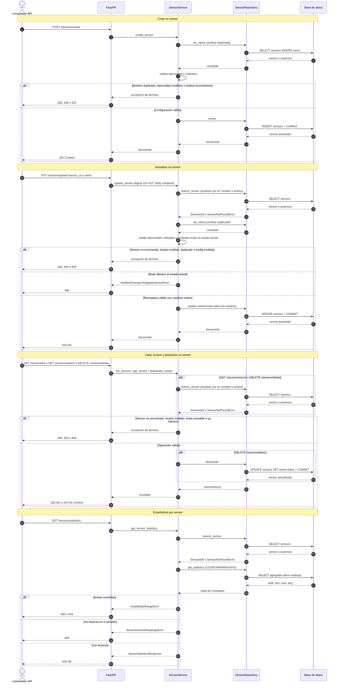
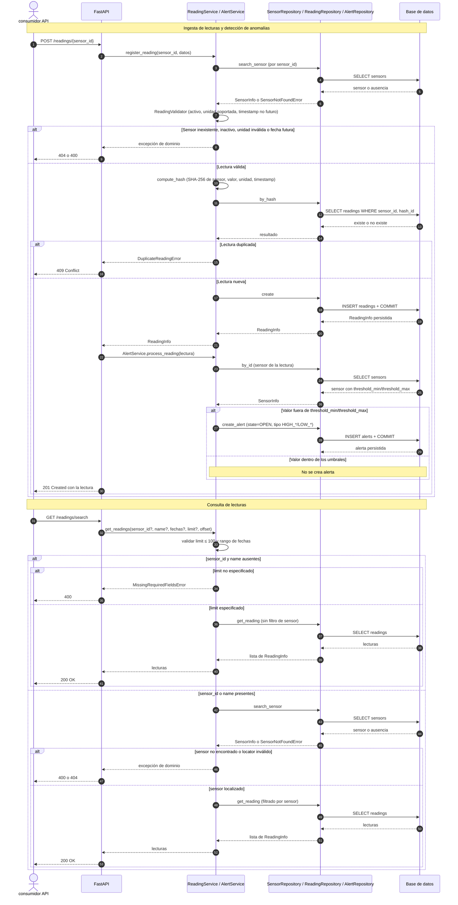
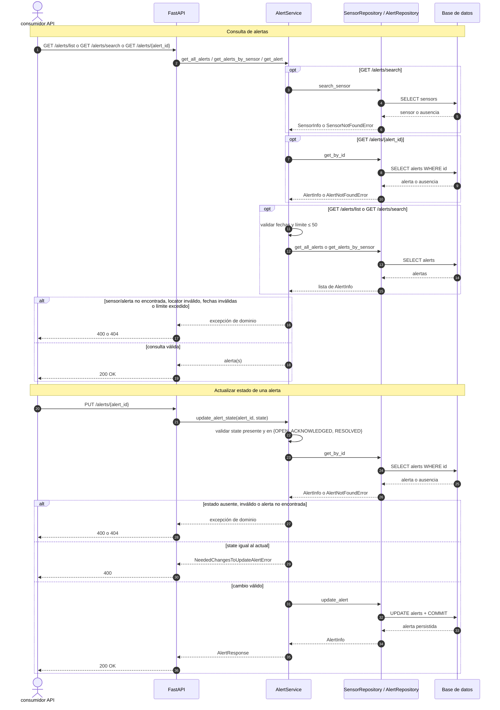

<p align="center">
  
</p>

---
<p align="center">
  <a href="https://github.com/lamunuwa/sdlc-electronica-valentina/actions/workflows/ci.yaml"></a> <a href="https://sensorhub-api-odm7.onrender.com/docs"></a> <a href="https://sensorhub-api-odm7.onrender.com/health"></a>  
</p>

**SensorHub** es un sistema de backend robusto para telemetría IoT industrial. Basado en **FastAPI** y diseñado para la ingesta, almacenamiento y análisis de datos provenientes de sensores en entornos críticos.

## Características

- **Sistema integral de sensores:** Realiza operaciones CRUD completas con desactivación lógica (soft delete), consulta por ID o nombre, estadísticas individuales y control del ciclo de vida.
- **Ingesta de lecturas idempotentes:** Registro masivo y unitario protegido por deduplicación hash SHA-256 (sensor + valor + unidad + timestamp), evitando datos duplicados en la red.
- **Validación de dominio robusta:** Validación dinámico de variables por sensor (TEMPERATURE, HUMIDITY, DISTANCE), unidades físicas reales y verificación de umbrales. Extensible a nuevos tipos de sensor.
- **Motor de alertas automatico:** Detección en tiempo real de anomalías (HIGH/LOW) ante lecturas fuera de rango, junto con la gestión de su ciclo de vida (OPEN, ACKNOWLEDGED, RESOLVED).
- **Paginación y filtrado flexible:** Consultas optimizadas con filtros y límite de resultados por paginación.
- **Métricas e inteligencia agregada:** Procesamiento en tiempo real de métricas descriptivas (totales, mínimos, máximos y promedios) agrupadas por sensor.
- **Arquitectura escalable:** Diseño basado en capas (Servicio, Repositorio, Modelo, Validación) alineado con principios SOLID, contenedorización en Docker y pipeline CI/CD automatizado.

## Stack Tecnológico

| Componente | Tecnología |
| :--- | :--- |
| **Lenguaje** | Python 3.12 |
| **Framework** | FastAPI + Uvicorn |
| **Validación & Schemas** | Pydantic |
| **Base de Datos** | PostgreSQL 16 |
| **ORM & Migraciones** | SQLAlchemy 2.0 + Alembic |
| **Contenerización** | Docker + Docker Compose |
| **CI/CD** | GitHub Actions |
| **QA & Linter** | Ruff, Mypy, Pytest + Coverage |

## Estructura del Repositorio

```text
├── .github/            # GitHub Actions
├── app/
│   ├── core/           # Configuración general
│   ├── models/         # Modelos de dominio y ORM
│   ├── repositories/   # Acceso a datos
│   ├── routers/        # Endpoints
│   ├── schemas/        # Esquemas y DTOs
│   └── services/       # Lógica de negocio y validaciones
├── archive/            # Archivos de prácticas pasadas
├── docs/               # Documentación de la API
├── migrations/         # Control de versiones de BD (Alembic)
├── test/               # Suite de pruebas
├── Dockerfile          # Imagen para contenedores
├── requirements.txt    # Dependencias del proyecto
├── docker-compose.yml  # Configuración del entorno de orquestación
└── render.yaml         # Infraestructura como Código (Render)
```

## Instalación

```bash
# Clona el repositorio
git clone https://github.com/lamunuwa/sdlc-electronica-valentina.git
cd sdlc-electronica-valentina

# Crea el entorno virtual
python3 -m venv .venv
# En Linux/macOS:
source .venv/bin/activate
# En Windows (PowerShell):
.venv\Scripts\activate

pip install -r requirements.txt

# Levanta contenedores
docker compose up o docker compose up -d
```

## Uso

Una vez levantado el servidor, la API estará disponible en `http://localhost:8000`.

- **Documentación Interactiva (Swagger):** http://localhost:8000/docs
- **Health Check:** http://localhost:8000/health

También puedes probar la instancia desplegada en la nube sin levantar contenedores: https://sensorhub-api-odm7.onrender.com

## Testing

```bash
# Corre las pruebas y linters
pytest
ruff check app test
mypy app test
```

## Flujo secuencial

<p align="center">Flujo de los endpoint de SENSORS</p>



---

<p align="center">Flujo de los endpoint de READINGS</p>



---

<p align="center">Flujo de los endpoint de ALERTS</p>



## Demo de SensorHub

<p align="center">
  
</p>

Para ver una explicación detallada del proyecto y su funcionamiento, puedes consultar el video de demostración completo aquí:
